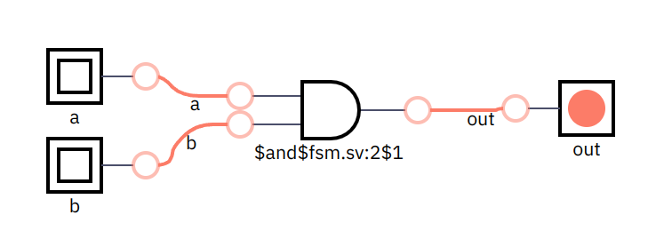
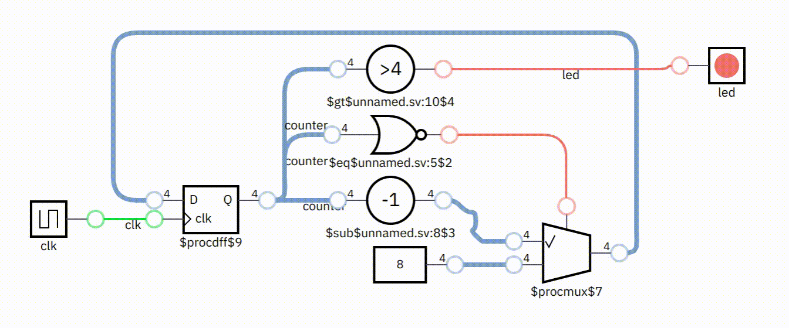

# XiaoXuan Logic Language

一个现代的、高效率、易重用的硬件描述语言（HDL），旨在像开源软件一样开发硬件。

a modern, efficient and reusable hardware description language (HDL), the goal is to develop hardware just like open source software.

## 什么是硬件描述语言？

硬件描述语言是编程语言当中的一种，用于构建数字逻辑电路和芯片。

### 简单示例

下列是 XiaoXuan Logic 的一些示例程序：

1. 一个简单的 `逻辑与门` 程序

```js
function add_gate(bit a, bit b) -> (bit out) {
    out = a & b
}
```

上面一段代码将会生成如下的电路：



2. 一个闪动指示灯程序

```js
#[clock]
function blink() -> (bit led) {
    var number
    let max = 4'b0111
    let next_number = (number == 0 ? max : number - 1)
    number = reg(next_number, max)
    led = (number == 0)
}
```

XiaoXuan Logic 内置图形化的可交互的仿真界面，且拥有丰富的虚拟外设，方便调试，下面是仿真界面：



XiaoXuan Logic 能生成高质量的 SystemVerilog 代码，用于 "烧录" 到 FPGA 制作自己的芯片或者生成 ASIC：

```verilog
module blink(input clk, output logic led);
  logic [3:0] counter = 4'b0111;

  always_ff @(posedge clk)
    if (counter == 4'b0000)
      counter <= 4'b0111;
    else
      counter <= counter - 1;

  assign led = counter == 4'b0000;
endmodule
```

下图是上面的程序下载到 FPGA 的运行情况：


_注：上面代码中的 counter 初始值需要根据开发板的实际时钟频率调整_

3. 一个自制的 CPU

下面的代码实现了一个 RISC-V 的 CPU，除了 CSR 寄存器相关的指令尚未实现，RV32I 的其余指令均已实现，可见 XiaoXuan Logic 语言非常简洁。编译后既可以在交互式仿真环境里运行，也可以下载到 FPGA 形成一个真正的硬件 CPU。

```js
function rv32i(...) -> (...) {
    // todo
}
```

示例还带有分别通过 RISC-V 汇编、C 语言、Rust 语言实现的 "Hello World" 程序，字符串将会通过 UART 串口在主机输出。程序的详细说明请转到教程 [一步一步实现 RISC-V CPU](docs/tutorial/README.md) 下面是程序下载到 FPGA 之后并在显示器输出 "Hello World" 的视频。


### 进阶示例

1. 自制示波器

该示例演示了如何实现 GPIO 接口、I2C 接口的 OLED 显示屏，以及结合自制 RISC-V CPU 和 Rust 语言编写的应用程序，最终实现了一个硬件产品。


项目的详细情况请见 [RISC-V Oscilloscope](https://github.com/hemashushu/risc-v-oscilloscope)

2. XiaoXuan Console

该项目是一个 8 位风格的游戏主机，项目包括了一个自制 RISC-V 32I CPU、一个 8 位音效发生器、SPI Flash 驱动、SD Card 驱动、SPI 接口的 LCD 显示屏驱动、XiaoXuan RTOS 提供多任务的支持、XiaoXuan Micro 提供图形库以及实现一个简单的像素风格小游戏。

项目的详细情况请见 [XiaoXuan Console](https://github.com/hemashushu/xiaoxuan-console)

## 特色功能

是静态类型语言，能自动推导类型，

TODO

## 文档

TODO

## 与其它 HDL 语言对比

TODO