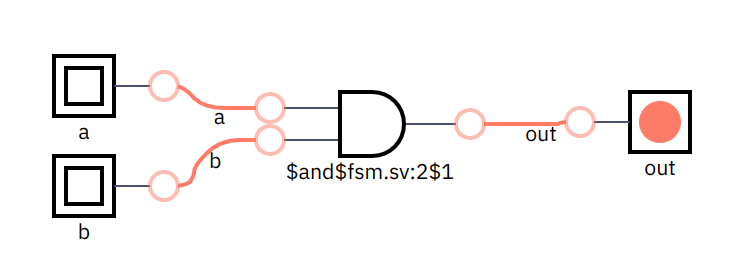
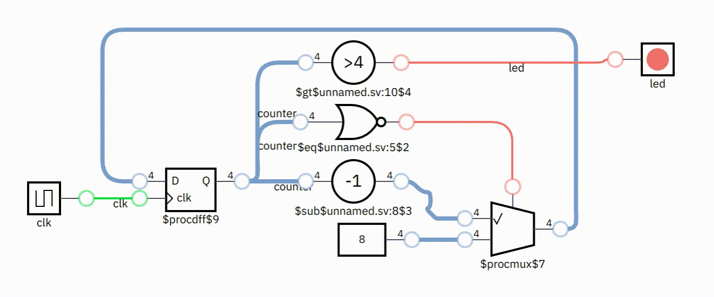
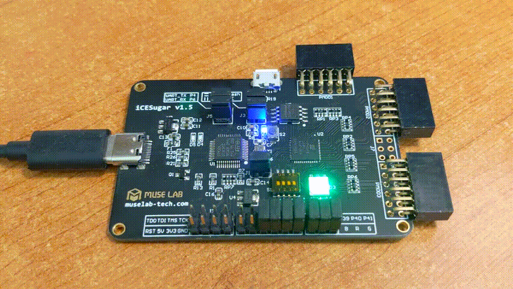
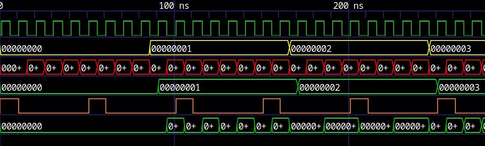

# 小萱逻辑语言

a modern, efficient and reusable hardware description language (HDL), the goal is to develop hardware just like open source software.

一个现代的、高效率的、易重用的硬件描述语言（HDL），旨在像开源软件一样开发硬件。

- - -
| [中文](/README.zh-hans.md) | [English](/README.md) |
- - -

## 什么是硬件描述语言？

一种用于描述数字逻辑的语言，用于开发和构建数字电路和芯片硬件。在外观上跟一般的软件开发编程语言（比如 C、Java、Python 等语言）相似，不过硬件描述语言的生成目标是硬件而不是软件。

### 简单示例

下列是 _小萱逻辑语言_ 的一些示例程序：

1. 一个简单的逻辑 `与门` 程序

```js
function add_gate(bit a, bit b) -> (bit out) {
    out = a & b
}
```

上面代码将会生成如下的电路：



2. 一个闪动的指示灯程序

```js
#[clock]
function blink() -> (bit led) {
    var number
    let max = 4'b1000
    let next_number = (number == 0 ? max : number - 1)
    number = reg(next_number, max)
    led = (number > 4'b0100)
}
```

_小萱逻辑语言_ 内置图形化的可交互的仿真界面，且拥有丰富的虚拟外设方便调试，下面是上面代码生成的仿真界面：



_小萱逻辑语言_ 能生成高质量的 SystemVerilog 代码，用于 "烧录" 到 FPGA 制作自己的芯片硬件，也可以交由芯片工厂生成 ASIC（专用集成电路），下面是上面代码生成的 SystemVerilog 代码：

```verilog
module blink(input clk, output logic led);
  logic [3:0] counter = 4'b1000;

  always_ff @(posedge clk)
    if (counter == 0)
      counter <= 4'b1000;
    else
      counter <= counter - 1;

  assign led = counter > 4'b0100;
endmodule
```

下图是上面的程序 "烧录" 到 FPGA 的工作情况：



3. 一个自制的 CPU

下面的代码实现了一个 RISC-V CPU，虽然代码很短，却是一个相对完整的 RV32I CPU（CSR 寄存器相关的指令尚未实现），该 CPU 已经可以运行由汇编、C 语言、Rust 语言生成的程序。

```js
function rv32i(...) -> (...) {
    // todo
}
```

上面的代码既可以在交互式仿真环境里运行，也可以 "烧录" 到 FPGA 形成一个真正的硬件 CPU。示例中带有一个用 Rust 写的 "Hello World" 程序，字符串将会通过 UART 串口在主机输出，详细信息请转到教程 [一步一步从零开始实现一个 RISC-V CPU](docs/tutorial/README.md)。

下图是程序 "烧录" 到 FPGA 之后并在显示器输出 "Hello World" 的情况。


### 进阶示例

1. 自制示波器

该项目演示了如何实现 GPIO 接口、I2C 接口的 OLED 显示屏，以及结合自制的 CPU 和 Rust 语言编写的应用程序，最终实现了一个完整的硬件产品。


项目的详细情况请见 [RISC-V Oscilloscope](https://github.com/hemashushu/risc-v-oscilloscope)

2. XiaoXuan Console

该项目是一个 8 位风格的游戏主机，项目包括了一个自制 RISC-V CPU、一个 8 位音效合成器、SPI Flash 驱动、SD Card 驱动、SPI 接口的 LCD 显示屏幕驱动，由 XiaoXuan RTOS 提供多任务的支持、XiaoXuan Micro 提供图形库以及编程环境。是一个完整的生动有趣的软件、硬件综合实践项目。

项目的详细情况请见 [XiaoXuan Console](https://github.com/hemashushu/xiaoxuan-console)

## 特色功能

1. 从编程、仿真、验证、综合、布线整套工具链都是开源免费，无需购买商业 EDA 软件；
2. 带有包和依赖管理工具，能够像开源软件一样轻松重用第三方开源库（IP）；
3. 集成了可交互的仿真界面，可以实时观测各线路的信号值；内置诸如按钮、开关、DIP 开关、指示灯、数码管、LED 矩阵、常见传感器、蜂鸣器、步进电机、甚至显示屏幕和串口终端等虚拟外设，极大地节省硬件调试时间；
4. 集成了现代的测试框架，可以迅速验证模块的设计，内置波形图生成器和查看器；



## 与其它硬件描述语言的对比

### Verilog/VHDL

Verilog 和 VHDL 是目前被广泛支持的硬件描述语言，虽然一直有更新，不过因为面世时间久远（将近 40 年），语言有较多的历史包袱，缺少统一的模块管理工具和验证（测试）工具，同时也缺少现代编程语言的特性，当面对较为复杂的硬件设计时，使用它们会比较吃力。

_小萱逻辑语言_ 吸收了很多现代编程语言的特性，具有较强的语言表达能力，能减少大量冗余的（有规律的重复的）代码，且自带仿真工具、验证（测试）工具以及模块和依赖管理工具，开发工作从此变得轻松且高效率。

### Chisel/SpinalHDL

Chisel 和 SpinalHDL 都是比较新的硬件描述语言，具有较高的知名度，且有成功的应用案例。不过它们并不是从头设计的一门语言，而是基于 Scala 的领域特定语言（DSL）和一套库，所以单纯从语言方面来说它们会稍显复杂，而且程序的运行效率不高。

_小萱逻辑语言_ 受到了 Chisel 的启发，语言是重新设计的，在语言上显得非常简单、精炼，毫无含糊的、多余的东西，另外 _小萱逻辑语言_ 在验证（测试）时，会先编译成 WebAssembly 代码，然后再通过 [XiaoXuan VM](https://github.com/hemashushu/xiaoxuan-vm) JIT 即时编译运行，所以运行效率非常高，响应速度非常快，比起 Chisel 和 SpinalHDL，验证所需要的时间大大地减少，从而提高工作效率。

## 从这里开始走起

1. [安装及配置 _小萱逻辑_ 开发环境，以及书写第一个 Blink 程序](docs/install/README.md)
2. [通过实例从零开始一步一步学习数字电路、FPGA 和 _小萱逻辑_ 语言](docs/examples/README.md)
3. [通过实例从零开始一步一步学习自制 RISC-V CPU](docs/tutorial/README.md)
4. [小萱逻辑语言参考手册](docs/reference/src/SUMMARY.md)

## 常见问题

TODO